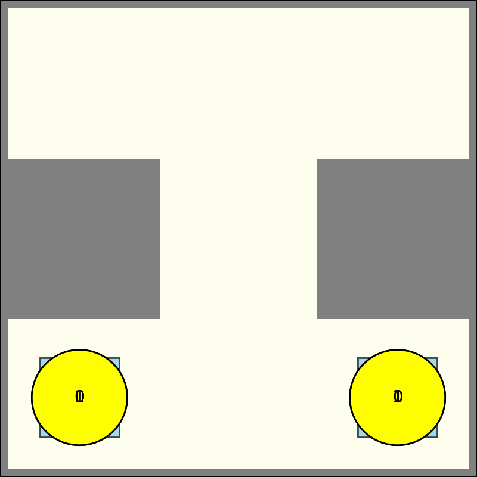
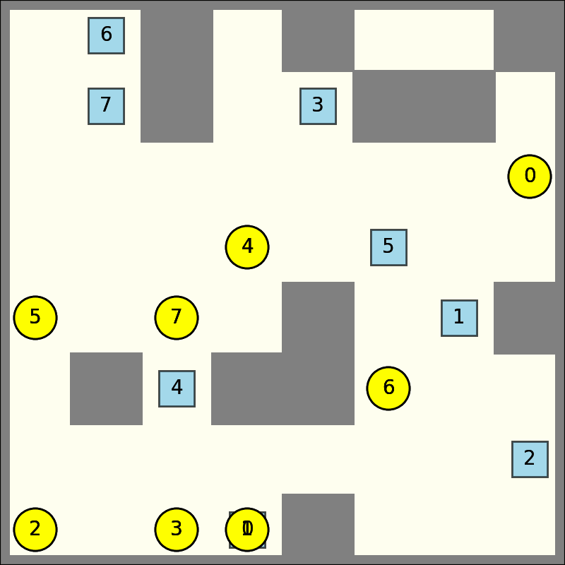
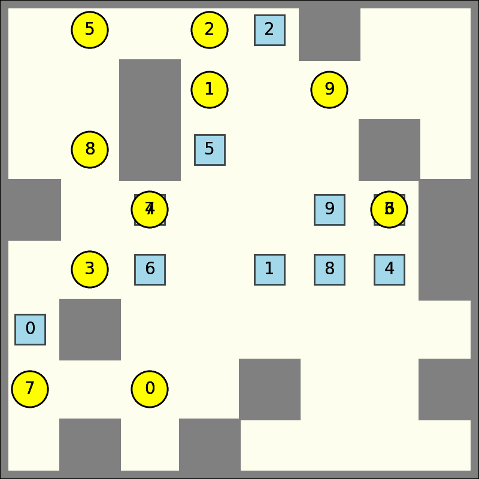

# 基于冲突搜索算法 (CBS) 的实现

该项目是基于冲突搜索(Conflict-Based Search)算法的Python实现，用于解决多智能体路径规划问题。CBS算法是一种集中式的计算最优解的多智能体路径规划算法，具体原理和实现方法可参考项目内`CBS详解笔记`

## 一、算法概述

CBS是一个两层算法：

1. **顶层搜索**：在约束树上进行搜索，每个节点包含一组约束和相应的解决方案及其成本
2. **底层搜索**：对每个智能体使用 $A*$ 算法在给定约束下寻找最短路径

当检测到冲突时，算法会创建新的约束来避免这些冲突，并在约束树中生成新的节点。算法保证找到最优解（如果存在解决方案）。

## 二、结果展示

* 3x3地图 2障碍物 2智能体



* 8x8地图 12障碍物 8智能体



* 8x8地图 12障碍物 10智能体



* 32x32地图 204障碍物 30智能体


## 三、运行方法

### 执行CBS算法（也可直接运行main.py，内有默认输入文件）

    python main.py --input input.yaml --output output.yaml

### 可视化结果

    python visualize.py input.yaml output.yaml

### 保存动画

    python visualize.py input.yaml output.yaml --save result.gif --speed 1 

## 四、文件说明

- `main.py`: 主函数（可直接执行，内有默认输入文件路径）
- `cbs.py`: CBS算法的主要实现（顶层搜索）
- `a_star.py`: $A*$ 搜索算法，用于CBS的低层搜索
- `visualize.py`: 可视化工具，用于显示和保存路径规划结果
- `entity.py`: 多个类的定义（如智能体，路径，冲突，约束等类）
- `ct_node.py`: CT节点的类定义
- `input.yaml`: 3x3网格测试示例
- `input_8x8.yaml`: 8x8网格测试示例
- `input_32x32.yaml`: 32x32网格测试示例
- `output.yaml`: 3x3网格测试示例输出
- `/map`: 输入文件文件夹，含8x8和32x32两种规格大小地图

## 五、文件格式

### 输入文件格式

输入文件使用YAML格式，包含地图尺寸、障碍物位置和智能体信息：

```yaml
agents:
-   start: [0, 0]  # 起始坐标
    goal: [2, 0]   # 目标坐标
    name: agent0   # 智能体名称
-   start: [2, 0]
    goal: [0, 0]
    name: agent1
map:
    dimensions: [3, 3]  # 地图尺寸
    obstacles:          # 障碍物位置
    - !!python/tuple [0, 1]
    - !!python/tuple [2, 1]
```

### 输出文件格式

输出文件同样使用YAML格式，包含每个智能体的路径和总成本：

```yaml
cost: 4  # 总成本
schedule:  # 路径规划方案
  agent0:  # 智能体0的路径
  - t: 0   # 时间步
    x: 0   # x坐标
    y: 0   # y坐标
  - t: 1
    x: 1
    y: 0
  - t: 2
    x: 2
    y: 0
  agent1:  # 智能体1的路径
  - t: 0
    x: 2
    y: 0
  - t: 1
    x: 1
    y: 0
  - t: 2
    x: 0
    y: 0
```

## 参考文献

1. **核心文献**
   
   * [Conflict-based search for optimal multi-agent pathfinding](https://www.sciencedirect.com/science/article/pii/S0004370214001386) 

2. **次要文献**
   
   * [刘志飞,曹雷,赖俊,等.多智能体路径规划综述[J].计算机工程与应用,2022,58(20):43-62.](https://kns.cnki.net/kcms2/article/abstract?v=C4JADW50D8u_nfA8xU-o7_upqKXiRfM9MgZftSEmpiLzTz8gCXTveg633ZbGm0AroXDoHsLIUMK-6KBmT5wKRVmNU4LB_95rn6FuXGRNVkmHy11un7pGumd1TWpQKcWvv5THUXwmQNwdGnsMGwFh7EYKAyD2J8oPj_fnBF9Pw54=&uniplatform=NZKPT)
   
   * [基于冲突搜索算法的多机器人路径规划](https://kns.cnki.net/kcms2/article/abstract?v=C4JADW50D8uV0BtqG0j66lwxJEaz11vl6RpKS7db8KXc_kX8XTjaqqhu_xtwzgqfSnMD9SMQeDPYqQJ9EM7pgFlAyz_KcrHr9ojq6obDTMUrIBzeJrreSgQUjUc2rkcL5VeuRzlwYjKGLy--CwSO7e6WXD0Gkvbe_SpcLnsX4v8=&uniplatform=NZKPT)
   
   * [On the Completeness of Conflict-Based Search: Temporally-Relative Duplicate Pruning](https://arxiv.org/html/2408.09028?_immersive_translate_auto_translate=1)
